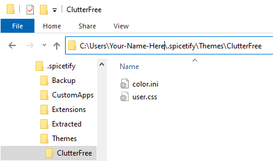

# ClutterFree
The Spotify Desktop client developers seem to think that my computer monitor is a tablet or even a smartphone, decreasing the information density and cluttering my screen. 

This repository contains a theme for [spicetify](https://github.com/khanhas/spicetify-cli/wiki/Installation), a tool that lets you spice up the Spotify client.

# Disclaimer
Use spicetify at your own risk.

I'm not affiliated with Spotify or spicetify at all, just a paying customer that wants to get the most out of the former's services.

# Installation
* [Install spicetify-cli](https://github.com/khanhas/spicetify-cli/wiki/Installation).
* [Run `spicetify`](https://github.com/khanhas/spicetify-cli/wiki/Basic-Usage) to generate the default configuration file.
* Verify that command returned no errors.
* Copy this repository's `src` folder's contents into spicetify's themes folder, under a new directory `ClutterFree`. It'll look like this (and I'll provide a zip later):
  
* Open the configuration file, by default found at `%USERPROFILE%\.spicetify\config-xpui.ini`.
* Find the line that states `current_theme = SpicetifyDefault`, and change it to `current_theme = ClutterFree` (may contain more or fewer spaces, that doesn't matter).
* On the console, run `spicetify backup apply`. This will back up your Spotify, and apply this theme.
